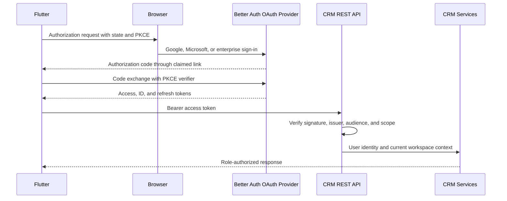

# Exposed API reference

This document describes the HTTP API exposed by the CRM API process.

It covers authentication, authorization, tRPC, REST, native controllers, and internal routes.

Verified on 2026-08-29 against the current source and generated router.

> [!WARNING]
> The process mounts more routes than the supported CRM contract.
> Use tRPC or the REST bridge for CRM data.
> Use Better Auth routes only for sign-in, sessions, OAuth, and SSO callbacks.

> [!WARNING]
> Conversation sharing is not anonymous in the current implementation.
> Both the shared conversation procedure and attachment controller require authentication.

> [!CAUTION]
> Better Auth mounts organization, invitation, SAML, and API-key routes.
> These routes do not use the CRM service authorization paths.
> Treat them as unsupported until their policy behavior receives a separate audit.

## Surface summary

| Surface | Base path | Count | Primary purpose |
| --- | --- | ---: | --- |
| tRPC | `/api/trpc` | 160 procedures | Type-safe application data API |
| REST bridge | `/rest` | 159 operations | OpenAPI transport for tRPC procedures |
| Better Auth | `/api/auth` | 69 mounted routes | Sign-in, sessions, providers, and plugin endpoints |
| Native controllers | Various paths | 18 operations | Health, profile, tracking, attachments, and cron work |
| Swagger UI | `/` | 1 page | Interactive REST documentation |
| OpenAPI JSON | `/openapi.json` | 1 document | Native controllers and REST bridge |

The tRPC router contains 21 namespaces.

The REST bridge omits only `users.me`.

The native `GET /auth/me` endpoint provides the equivalent profile operation.

## Choose a transport

Use tRPC from the web application or another TypeScript client.

Use the REST bridge from scripts and systems that use OpenAPI.

Use native controllers for health, auth status, tracking intake, files, and scheduled work.

Use Better Auth endpoints for authentication protocol flows.

Do not use raw Better Auth organization routes as the CRM workspace API.

## Quick start

The local API uses `http://localhost:3001` by default.

Fetch the generated OpenAPI document:

```bash
curl --fail-with-body http://localhost:3001/openapi.json
```

Check API and database health:

```bash
curl --fail-with-body http://localhost:3001/health
```

Call an authenticated REST bridge route with an API key:

```bash
curl --fail-with-body \
  --header 'x-api-key: crm_REPLACE_WITH_KEY' \
  http://localhost:3001/rest/companies/options?q=acme
```

Call a REST mutation:

```bash
curl --fail-with-body \
  --request POST \
  --header 'content-type: application/json' \
  --header 'x-api-key: crm_REPLACE_WITH_KEY' \
  --data '{"name":"Acme","domain":"acme.com"}' \
  http://localhost:3001/rest/companies
```

Call a tRPC query with a browser session:

```typescript
const result = await trpc.companies.byId.query({ id: companyId });
```

The OpenAPI document remains the authority for serialized REST parameters.

The Zod contracts remain the authority for accepted values.

## Authentication

### Browser sessions

Better Auth owns browser sessions under `/api/auth/*`.

The session cookie name is `crm.session_token`.

Production enables secure cookies.

`AUTH_COOKIE_DOMAIN` enables cross-subdomain cookies when configured.

Sessions expire after seven days.

Active sessions refresh after one day.

The signed cookie cache lasts five minutes.

Better Auth uses database-backed rate limiting.

Trusted origins come from `APP_URL` and configured origins.

Email and password authentication is disabled.

Google and Microsoft social sign-in are optional.

OIDC SSO providers are stored in the database.

The sign-in allow-list comes from `ALLOWED_SIGN_IN`.

An empty allow-list rejects every new user.

A session creation hook adds the user to the singleton workspace.

The first user becomes the workspace owner.

### API keys

API keys use the `x-api-key` request header.

Generated keys use the `crm_` prefix.

A key name contains between one and 64 characters.

A key can expire after one through 365 days.

A null expiration creates a non-expiring key.

The key plugin converts a valid key into a Better Auth session.

That session lets the tRPC authorization middleware identify the key owner.

Most tRPC and REST bridge operations accept sessions or API keys.

The `apiKeys` namespace accepts browser sessions only.

Its middleware rejects every request containing `x-api-key`.

Use these supported management routes:

| Operation | tRPC | REST |
| --- | --- | --- |
| List keys | `apiKeys.list` | `GET /rest/api-keys` |
| Create key | `apiKeys.create` | `POST /rest/api-keys` |
| Revoke key | `apiKeys.revoke` | `DELETE /rest/api-keys/{id}` |

The create response returns the complete key once.

Later list responses return only key metadata and the visible prefix.

### Cron bearer secret

Internal scheduled routes use `Authorization: Bearer <CRON_SECRET>`.

They do not use browser sessions or API keys.

Each route compares the complete header with a timing-safe comparison.

An absent `CRON_SECRET` returns `503 Service Unavailable`.

A missing or incorrect bearer value returns `403 Forbidden`.

### Anonymous access

The following supported operations need no session:

| Method | Path | Purpose |
| --- | --- | --- |
| GET | `/health` | Check API and database liveness |
| GET | `/auth/session` | Report optional session state |
| GET | `/rest/sso/sign-in-options` | List configured sign-in choices |
| GET | `/api/t/config/:siteId` | Read public tracking configuration |
| POST | `/api/t/e` | Submit tracking events |
| GET | `/api/auth/ok` | Check Better Auth availability |
| POST | `/api/auth/sign-in/social` | Start social sign-in |
| POST | `/api/auth/sign-in/sso` | Start SSO sign-in |
| GET or POST | OAuth and SSO callbacks | Complete provider authentication |

Tracking collection always returns `204 No Content`.

It returns 204 for accepted, rejected, and unreadable batches.

This behavior prevents the collector from exposing processing details.

## Authorization

### Authentication middleware

Every protected tRPC router uses `AuthMiddleware`.

The middleware reads the Better Auth session from the request context.

It returns `UNAUTHORIZED` when no session user exists.

It adds the authenticated user to the tRPC context.

The same middleware runs through tRPC and the REST bridge.

The REST bridge does not implement a second authorization policy.

Native Nest controllers use the Better Auth module guard.

`@AllowAnonymous()` disables that guard for a route.

`@OptionalAuth()` allows both signed-in and signed-out requests.

### Workspace roles

The singleton workspace has three roles.

| Role | General CRM data | Workspace settings | Member roles | Currency | Tracking | SSO | Shared Slack connection |
| --- | --- | --- | --- | --- | --- | --- | --- |
| `owner` | Read and write | Manage | Manage | Manage | Manage | Manage | Manage |
| `admin` | Read and write | Manage | Manage | Manage | Manage | Manage | Manage |
| `member` | Read and write | Read | Read | Read | Read | Read | Read |

The API is single tenant.

CRM records do not contain an organization authorization boundary.

Every authenticated workspace user can access the general CRM data surface.

Owner and admin checks occur inside services.

The UI permission flags do not replace service checks.

### Protected management operations

| Area | Restricted operations | Required role |
| --- | --- | --- |
| Workspace | Update name, slug, or website | Owner or admin |
| Workspace | Change a member role | Owner or admin |
| Currency | Change reporting currency or rates | Owner or admin |
| Tracking | Change flags, domains, identifiers, or verification | Owner or admin |
| SSO | Register or remove a provider | Owner or admin |
| Slack | Connect, reconnect, or disconnect the shared workspace | Owner or admin |

The workspace role change uses a transaction.

It locks owner rows before it counts them.

It refuses to demote the last owner.

SSO list and settings reads require authentication.

SSO provider registration and removal also require owner or admin status.

Tracking activity reads remain available to every authenticated user.

### Agent object authorization

Every agent operation requires an authenticated workspace member.

A private draft is visible only to its creator.

A missing private draft returns `NOT_FOUND`.

This response does not reveal the draft to another user.

An agent creator can manage that agent.

A workspace owner or admin can manage another creator's agent.

Other members can read non-private agents.

Other members cannot change agents that they did not create.

### Record authorization

Companies, contacts, deals, activities, fields, and saved views use workspace-wide access.

These records have no per-user read boundary.

Owner fields support assignment and filtering.

Owner fields do not restrict record access.

API keys act with the identity of their owning user.

Service-level role checks still apply to API-key requests.

### Current authorization findings

The conversation sharing procedures use the protected router middleware.

The attachment controller also requires a session.

A share token does not provide anonymous access by itself.

Raw Better Auth organization endpoints remain mounted.

Those endpoints do not call `WorkspaceService`.

Raw Better Auth API-key endpoints also remain mounted.

Use the supported session-only `apiKeys` namespace for key management.

The general settings mutations have authentication checks only.

Any authenticated member or API key can change those values.

## Implementing a Dart or Flutter client

Use the REST bridge for Dart and Flutter applications.

The bridge exposes the same validation, services, and authorization as tRPC.

Do not implement the tRPC wire format in Dart.

TypeScript router types do not provide Dart runtime validation.

Generate Dart models from the runtime OpenAPI document instead.

### Select an authentication model

The API supports browser sessions, API keys, and OAuth access tokens.

The OAuth server supports native Authorization Code Flow with PKCE.

Choose the model from this table.

| Client | Recommended credential | Current support | Main restriction |
| --- | --- | --- | --- |
| Flutter mobile | OAuth with PKCE | Supported | The mobile application still needs AppAuth integration |
| Flutter desktop | OAuth with PKCE | Supported | Register an exact desktop redirect URI |
| Flutter web | Better Auth cookie | Supported | Deployment must satisfy origin and cookie rules |
| Public mobile distribution | Native PKCE flow | Supported | Use the registered `compcrm-flutter` client |
| Server-side Dart | API key | Supported | The server must protect and rotate the key |

Do not ship one shared API key inside the application bundle.

Every installed application can extract a bundled secret.

Provision a separate key for each user or managed device.

Revoke only the affected key after loss or compromise.

### Recommended client structure

Keep transport, credentials, generated models, and application state separate.

```text
lib/
├── api/
│   ├── generated/
│   ├── crm_api_client.dart
│   ├── crm_api_error.dart
│   └── crm_auth_interceptor.dart
├── auth/
│   ├── credential_store.dart
│   ├── secure_api_key_store.dart
│   └── session_controller.dart
├── workspace/
│   ├── workspace_capabilities.dart
│   └── workspace_repository.dart
└── features/
```

The generated package owns wire models and endpoint methods.

Repositories convert wire models into application domain models.

Widgets consume application state and never read credentials.

One client instance must target one configured CRM origin.

Never forward CRM credentials during redirects to another origin.

### Generate the Dart client

Fetch `/openapi.json` from the same release that the client targets.

Store the document as a reviewed build input.

Generate a `dart-dio` client with a pinned OpenAPI Generator release.

```bash
curl --fail-with-body \
  https://crm.example.com/openapi.json \
  --output api/openapi.json

openapi-generator-cli generate \
  --input-spec api/openapi.json \
  --generator-name dart-dio \
  --output packages/compcrm_api
```

Do not edit generated files manually.

Regenerate them when `/openapi.json` changes.

Review model nullability, date values, enums, and operation names after generation.

Fail continuous integration when regeneration changes committed output.

The runtime document can change without a committed OpenAPI artifact.

Capture the document from the deployed version before releasing the client.

Use an injected `http.Client` for a small prototype.

Use generated code for a maintained application.

### Store an API key

Use platform secure storage for native Flutter applications.

Do not use `SharedPreferences`, source constants, assets, logs, or analytics properties.

The `flutter_secure_storage` package provides a common Keychain and Keystore interface.

Wrap the package behind a small application interface.

```dart
abstract interface class CredentialStore {
  Future<String?> readApiKey();
  Future<void> writeApiKey(String value);
  Future<void> deleteApiKey();
}
```

```dart
import 'package:flutter_secure_storage/flutter_secure_storage.dart';

final class SecureApiKeyStore implements CredentialStore {
  SecureApiKeyStore(this._storage);

  static const _key = 'compcrm_api_key';
  final FlutterSecureStorage _storage;

  @override
  Future<String?> readApiKey() => _storage.read(key: _key);

  @override
  Future<void> writeApiKey(String value) {
    return _storage.write(key: _key, value: value);
  }

  @override
  Future<void> deleteApiKey() => _storage.delete(key: _key);
}
```

Disable Android backup for storage that contains the wrapped key.

Configure iOS Keychain accessibility for the required background behavior.

Require device authentication before high-risk operations when the product needs that control.

Flutter web must not treat browser storage as a secure secret vault.

Use the Better Auth cookie model for Flutter web.

### Attach the API key

Add `x-api-key` only to requests for the configured CRM origin.

Do not add the key to Better Auth sign-in requests.

Do not add the key to image URLs or external attachment redirects.

```dart
import 'package:dio/dio.dart';

abstract interface class ApiKeyProvider {
  String? get apiKey;
}

final class CrmApiKeyInterceptor extends Interceptor {
  CrmApiKeyInterceptor({
    required this.apiKeys,
    required this.crmOrigin,
  });

  final ApiKeyProvider apiKeys;
  final Uri crmOrigin;

  @override
  void onRequest(
    RequestOptions options,
    RequestInterceptorHandler handler,
  ) {
    final request = options.uri;
    final sameOrigin = request.origin == crmOrigin.origin;

    if (sameOrigin) {
      final apiKey = apiKeys.apiKey;
      if (apiKey != null && apiKey.isNotEmpty) {
        options.headers['x-api-key'] = apiKey;
      }
    }

    handler.next(options);
  }
}
```

Load the secure value before constructing authenticated repositories.

Keep the loaded value only inside the authentication controller.

Construct `Dio` with a fixed HTTPS base URL in production.

Reject cleartext production URLs during application configuration.

Disable request-header logging for authenticated requests.

Redact `x-api-key`, `cookie`, and `set-cookie` in every diagnostic sink.

### Bootstrap identity and capabilities

Call `GET /rest/workspace` after loading a credential.

This operation accepts a browser session or API key.

It returns the workspace and the viewer's role.

It also returns `canRename` and `canChangeRoles` capabilities.

```dart
enum WorkspaceRole { owner, admin, member }

final class WorkspaceCapabilities {
  const WorkspaceCapabilities({
    required this.role,
    required this.canRename,
    required this.canChangeRoles,
  });

  final WorkspaceRole? role;
  final bool canRename;
  final bool canChangeRoles;

  bool get canManageWorkspace =>
      role == WorkspaceRole.owner || role == WorkspaceRole.admin;
}
```

Use server capability fields when the response provides them.

Centralize any temporary role mapping in one domain module.

Do not repeat role comparisons inside widgets.

The server remains the authorization authority.

Local capability checks control presentation only.

Every mutation must still handle `403 Forbidden`.

Do not send an organization identifier or tenant header.

The API resolves the fixed singleton workspace internally.

### Handle authentication state

Model authentication as explicit states.

| State | Meaning | Allowed action |
| --- | --- | --- |
| `unknown` | Secure storage has not completed | Show startup progress |
| `signedOut` | No credential exists | Show provisioning instructions |
| `checking` | The client validates a credential | Block protected mutations |
| `signedIn` | Workspace bootstrap succeeded | Load protected data |
| `forbidden` | Authentication succeeded without required permission | Keep the credential and explain access |
| `expired` | The server rejected the credential | Delete the credential and sign out |
| `offline` | The server is unreachable | Show cached data under local policy |

Do not treat every network failure as a sign-out.

Only an authentication response invalidates the local credential.

A `403` response does not invalidate authentication.

A timeout does not prove credential failure.

Validate the stored key through a protected REST request at startup.

Use `GET /rest/workspace` for this check.

### Map API failures

Convert transport failures into one sealed application error hierarchy.

| HTTP result | Client meaning | Recommended action |
| ---: | --- | --- |
| 400 | Invalid client input | Display field or request feedback |
| 401 | Missing, revoked, or invalid credential | Delete the key and require provisioning |
| 403 | Authenticated user lacks permission | Preserve the key and disable that action |
| 404 | Resource is absent or unavailable | Close stale detail state and refresh its list |
| 409 | A domain conflict exists | Refresh the record and show the conflict |
| 429 | The server rate limit applies | Respect `Retry-After` and delay further calls |
| 500–599 | The server failed | Preserve state and offer a bounded retry |
| Network failure | Connectivity failed | Preserve credentials and expose offline state |

Do not display raw server stacks or database messages.

Keep a request identifier when the response exposes one.

Never include credentials or full response bodies in crash reports.

### Retry safely

Retry idempotent reads after transient network failures.

Use capped exponential backoff with random jitter.

Respect `Retry-After` for rate-limit responses.

Do not retry create, update, archive, purge, or bulk mutations automatically.

A retry can repeat a completed mutation after a lost response.

Require an explicit user retry for those operations.

Cancel in-flight list requests when a newer filter replaces them.

Use server pagination instead of downloading complete collections.

### Cache without weakening authorization

Partition cached records by API origin and authenticated identity.

Do not reuse one user's cache after credential replacement.

Clear sensitive cached records during sign-out.

Encrypt sensitive offline data when the product retains it.

Do not infer authorization from previously cached roles.

Refresh workspace capabilities after sign-in and role-related `403` responses.

Keep optimistic updates reversible.

Restore previous state when the server rejects a mutation.

### Support Flutter web

Use same-origin deployment when possible.

The browser then manages the Better Auth cookie.

Cross-origin deployments require correct trusted origins, CORS, HTTPS, and credentialed requests.

Never copy the session cookie into Dart application storage.

Do not expose `crm.session_token` to application JavaScript.

Use `/auth/session` to check optional browser authentication.

Use `/auth/me` to read the signed-in profile.

Call `/rest/workspace` to load role and capability data.

### Recommended authentication target

API keys provide the only supported native credential today.

The CRM already authenticates browser users through Better Auth.

It also accepts Google, Microsoft, and stored OIDC SSO providers.

These integrations make CRM an OAuth client.

They do not make CRM an OAuth authorization server.

Add Better Auth's OAuth 2.1 Provider plugin for native and third-party clients.

Do not build custom authorization and token endpoints.

The provider supports OAuth discovery, OIDC, PKCE, refresh tokens, revocation, audiences, and JWKS.

Keep browser sessions for the web application.

Keep API keys for scripts and controlled server integrations.

Use OAuth access tokens for public Flutter applications.

Do not use Better Auth's bearer-session plugin as the final mobile protocol.

That plugin transports a session token but does not create an OAuth authorization contract.

Do not accept upstream provider tokens directly.

Google, Microsoft, and enterprise tokens target their own audiences and policies.

CompCRM must issue one consistent access token after upstream authentication.

### OAuth implementation status

The CRM now provides these capabilities.

| Capability | Current implementation |
| --- | --- |
| OAuth authorization server | Better Auth OAuth Provider runs under `/api/auth` |
| OIDC discovery | The issuer publishes OpenID Connect metadata and JWKS |
| Official mobile client | Startup reconciles public client `compcrm-flutter` |
| PKCE authorization | The native client requires Authorization Code and PKCE |
| CRM access tokens | Tokens use the `${API_URL}/api` audience |
| Bearer validation | One request-principal service verifies access tokens |
| Scope enforcement | Queries require `crm.read`; mutations require `crm.write` |
| Refresh lifecycle | Refresh tokens rotate with a 30-second reuse interval |
| OpenAPI security | Cookie, API-key, and bearer alternatives are documented |
| OAuth integration tests | Tests cover discovery, challenges, mixed credentials, and OpenAPI |

The Better Auth runtime and plugins use version `1.7.2`.

The independently versioned Better Auth CLI uses version `1.4.22`.

Device-session management remains future work.

### Recommended server design

Use CompCRM's Better Auth installation as the authorization server.

Add the Better Auth JWT and OAuth 2.1 Provider plugins.

Disable the standalone JWT token endpoint when OAuth Provider owns token issuance.

Disable automatic JWT response headers for the same reason.

Apply the required Better Auth schema migration.

Review the generated migration before applying it.

Register Flutter as a public client.

Set its token authentication method to `none`.

Do not assign a client secret to Flutter.

Require Authorization Code with S256 PKCE.

Disable dynamic client registration.

Register each production redirect URI exactly.

Use claimed HTTPS links instead of custom schemes when platform support permits them.

Configure one protected resource identifier for the CRM REST API.

Use that resource identifier as the access-token audience.

Define these initial scopes.

| Scope | Purpose |
| --- | --- |
| `openid` | Request OIDC identity |
| `profile` | Request basic profile claims |
| `email` | Request the signed-in email claim |
| `offline_access` | Request refresh-token issuance |
| `crm.read` | Read CRM resources |
| `crm.write` | Change CRM resources |

Keep scopes coarse and client-focused.

Keep workspace roles fine-grained and user-focused.

An access token must satisfy both checks.

For example, `crm.write` allows a write-capable client.

The user's current workspace role still decides administrative access.

Do not encode owner or admin authority as a durable token claim.

A role can change before the token expires.

Resolve workspace membership and role from current server data.

Keep API-key management browser-session-only.

Do not enable client credentials during the first OAuth phase.

Client credentials need a service-principal model that does not exist today.

Never represent a machine client as a synthetic user.

### Verify bearer tokens in the API

Create one OAuth verification boundary before controller or tRPC authorization.

Use Better Auth's `verifyAccessTokenRequest` resource-server API.

Validate these values for every bearer request.

| Value | Required check |
| --- | --- |
| Signature | Verify against the provider JWKS |
| `iss` | Match the configured CompCRM issuer exactly |
| `aud` | Match the CRM resource identifier exactly |
| `exp` | Reject expired access tokens |
| `nbf` | Reject tokens that are not active |
| `sub` | Resolve an existing CompCRM user |
| `scope` | Require the procedure's read or write scope |

Reject opaque bearer values during the first implementation.

JWT validation avoids an introspection request for every API call.

Map the verified subject into the existing authenticated context.

Then run the existing service and role authorization.

Do not create a second authorization policy inside the verifier.

Return a standards-compliant bearer challenge for invalid tokens.

Preserve current cookie and API-key behavior during migration.

The three credential types must converge on one authenticated user context.



### Implement the Flutter OIDC flow

Use `flutter_appauth` for Android, iOS, and macOS.

It uses the system browser and supports discovery, Authorization Code, and PKCE.

Configure the CRM issuer, public client identifier, redirect URI, resource, and scopes.

Read authorization and token endpoints from OIDC discovery.

Do not hardcode provider-specific Google or Microsoft endpoints.

Request `openid`, `profile`, `email`, `offline_access`, `crm.read`, and `crm.write`.

Use the access token in `Authorization: Bearer <token>`.

Never send the ID token to the REST API.

Keep the current access token in memory.

Store the rotated refresh token in platform secure storage.

Store only the minimum identity data required for startup presentation.

Serialize refresh operations through one in-flight operation.

Retry one failed request after a successful refresh.

Do not create a refresh loop after another `401` response.

Delete tokens after `invalid_grant`, explicit sign-out, or device revocation.

Treat user cancellation as a normal signed-out result.

Do not use an embedded web view for sign-in.

Do not send tokens through application links.

Only the short-lived authorization code returns through the link.

### Roll out OAuth safely

Implement the work in bounded phases.

1. The CRM aligns Better Auth runtime packages.
2. The CRM adds provider plugins, migrations, discovery, and the public client.
3. The CRM adds bearer verification and OpenAPI bearer security.
4. The CRM enforces `crm.read` and `crm.write` before service authorization.
5. The Flutter application adds AppAuth sign-in, secure refresh, and sign-out.
6. A later CRM change adds device-session management and revocation.
7. API keys remain available for automation.

Do not remove cookie sessions or API keys during the first release.

Run old and new authentication paths through the same authorization tests.

### OAuth and OIDC references

- [Better Auth OAuth 2.1 Provider](https://better-auth.com/docs/plugins/oauth-provider)
- [Better Auth resource-server verification](https://better-auth.com/docs/plugins/oauth-provider#api-server)
- [Better Auth JWT plugin](https://better-auth.com/docs/plugins/jwt)
- [Better Auth bearer-session plugin](https://better-auth.com/docs/plugins/bearer)
- [Flutter AppAuth package](https://pub.dev/packages/flutter_appauth)

### Test the Flutter integration

Use an injected HTTP client in unit tests.

Test these cases before release.

| Test | Expected result |
| --- | --- |
| Request targets the CRM origin | The client adds `x-api-key` |
| Request targets another origin | The client omits `x-api-key` |
| Credential storage returns null | The client enters `signedOut` |
| Workspace bootstrap returns 401 | The client deletes the stored key |
| Workspace bootstrap returns 403 | The client preserves the stored key |
| A member opens management UI | Restricted controls stay disabled |
| The server returns 429 | The client respects `Retry-After` |
| A mutation loses its response | The client does not retry automatically |
| The OpenAPI document changes | Generated client drift fails continuous integration |
| Logging captures a request | Credential headers remain redacted |
| Discovery reports the wrong issuer | The authentication test fails |
| A public client omits PKCE | The authorization request fails |
| An access token has another audience | The REST request returns 401 |
| An access token lacks `crm.read` | A protected read returns 403 |
| A refresh token is reused | The token family follows the configured reuse policy |
| A device session is revoked | Its next refresh fails |

Run an integration test against the current API release.

Use a dedicated test user and a short-lived API key.

Revoke that key after the test suite.

Never use a production owner key in automated tests.

### Platform requirements

Android applications need the `INTERNET` permission.

macOS applications need the network client entitlement.

iOS and Android builds need secure storage configuration.

Production applications must use HTTPS.

Development cleartext exceptions must target local development hosts only.

### Flutter implementation references

- [Flutter networking guidance](https://docs.flutter.dev/data-and-backend/networking)
- [Flutter authenticated request example](https://docs.flutter.dev/cookbook/networking/authenticated-requests)
- [OpenAPI Generator Dart Dio documentation](https://openapi-generator.tech/docs/generators/dart-dio/)
- [Flutter secure storage package](https://pub.dev/packages/flutter_secure_storage)

## Request validation and errors

tRPC inputs use Zod schemas.

The REST bridge uses the same schemas and services.

Native DTO validation removes unknown properties.

Native DTO validation also rejects non-whitelisted properties.

The global pipe enables implicit type conversion.

List procedures filter, sort, and paginate inside Prisma.

Typical list responses use this shape:

```json
{
  "rows": [],
  "total": 0,
  "facetCounts": {}
}
```

Domain services throw Nest HTTP exceptions.

The tRPC domain middleware maps selected statuses.

| HTTP status | tRPC code |
| ---: | --- |
| 400 | `BAD_REQUEST` |
| 401 | `UNAUTHORIZED` |
| 403 | `FORBIDDEN` |
| 404 | `NOT_FOUND` |
| 409 | `CONFLICT` |
| 429 | `TOO_MANY_REQUESTS` |
| Other | `INTERNAL_SERVER_ERROR` |

Zod errors receive readable messages.

Do not depend on internal stack traces or database error text.

## OpenAPI behavior

Swagger UI is available at `/`.

The JSON document is available at `/openapi.json`.

The document is built at runtime.

It merges Nest controller metadata with the tRPC REST bridge.

The document does not come from a committed artifact.

Router changes therefore change the runtime document.

Every `restMeta` call defaults to protected.

Only `sso.signInOptions` sets `protect: false`.

The document declares two security schemes.

| Scheme | Location | Name |
| --- | --- | --- |
| Cookie | Cookie header | `crm.session_token` |
| API key | Header | `x-api-key` |

Better Auth owns its routes independently.

Its full mounted route set is larger than the Swagger-supported CRM contract.

## Native controller inventory

| Method | Path | Access | Purpose | OpenAPI |
| --- | --- | --- | --- | --- |
| GET | `/auth/me` | Session | Read the current user profile | Included |
| GET | `/auth/session` | Optional session | Read session state | Included |
| GET | `/health` | Public | Check API and database | Included |
| GET | `/api/conversations/attachments/:id` | Session | Download an attachment | Included |
| GET | `/api/t/config/:siteId` | Public | Read tracking configuration | Included |
| POST | `/api/t/e` | Public | Collect tracking events | Included |
| GET | `/internal/sync/mailboxes` | Cron bearer | Run due mailbox work | Included |
| POST | `/internal/sync/mailboxes` | Cron bearer | Legacy scheduler method | Excluded |
| GET | `/internal/sync/google` | Cron bearer | Mailbox alias | Included |
| POST | `/internal/sync/google` | Cron bearer | Legacy mailbox alias | Excluded |
| GET | `/internal/sync/rates` | Cron bearer | Refresh exchange rates | Included |
| POST | `/internal/sync/rates` | Cron bearer | Legacy scheduler method | Excluded |
| GET | `/internal/telemetry/rollup` | Cron bearer | Roll up telemetry | Included |
| POST | `/internal/telemetry/rollup` | Cron bearer | Legacy scheduler method | Excluded |
| GET | `/internal/archive/prune` | Cron bearer | Purge expired archives | Included |
| POST | `/internal/archive/prune` | Cron bearer | Legacy scheduler method | Excluded |
| GET | `/internal/tracking/retention` | Cron bearer | Sweep tracking data | Included |
| POST | `/internal/tracking/retention` | Cron bearer | Legacy scheduler method | Excluded |

The attachment endpoint accepts an optional `share` query parameter.

The global session guard still runs before the controller method.

## Better Auth mounted route inventory

This table reports every mounted Better Auth path.

A mounted path is not always enabled or supported.

Email-password operations remain mounted but reject their disabled flow.

Organization creation and deletion are disabled by configuration.

The CRM product supports OIDC SSO configuration through `sso.*`.

The SAML protocol routes come from the Better Auth SSO plugin.

| Method | Path | Better Auth operation |
| --- | --- | --- |
| POST | `/api/auth/sign-in/social` | `signInSocial` |
| GET / POST | `/api/auth/callback/:id` | `callbackOAuth` |
| GET / POST | `/api/auth/get-session` | `getSession` |
| POST | `/api/auth/sign-out` | `signOut` |
| POST | `/api/auth/sign-up/email` | `signUpEmail` |
| POST | `/api/auth/sign-in/email` | `signInEmail` |
| POST | `/api/auth/reset-password` | `resetPassword` |
| POST | `/api/auth/verify-password` | `verifyPassword` |
| GET | `/api/auth/verify-email` | `verifyEmail` |
| POST | `/api/auth/send-verification-email` | `sendVerificationEmail` |
| POST | `/api/auth/change-email` | `changeEmail` |
| POST | `/api/auth/change-password` | `changePassword` |
| POST | `/api/auth/update-session` | `updateSession` |
| POST | `/api/auth/update-user` | `updateUser` |
| POST | `/api/auth/delete-user` | `deleteUser` |
| POST | `/api/auth/request-password-reset` | `requestPasswordReset` |
| GET | `/api/auth/reset-password/:token` | `requestPasswordResetCallback` |
| GET | `/api/auth/list-sessions` | `listSessions` |
| POST | `/api/auth/revoke-session` | `revokeSession` |
| POST | `/api/auth/revoke-sessions` | `revokeSessions` |
| POST | `/api/auth/revoke-other-sessions` | `revokeOtherSessions` |
| POST | `/api/auth/link-social` | `linkSocialAccount` |
| GET | `/api/auth/list-accounts` | `listUserAccounts` |
| GET | `/api/auth/delete-user/callback` | `deleteUserCallback` |
| POST | `/api/auth/unlink-account` | `unlinkAccount` |
| POST | `/api/auth/refresh-token` | `refreshToken` |
| POST | `/api/auth/get-access-token` | `getAccessToken` |
| GET | `/api/auth/account-info` | `accountInfo` |
| POST | `/api/auth/organization/create` | `createOrganization` |
| POST | `/api/auth/organization/update` | `updateOrganization` |
| POST | `/api/auth/organization/delete` | `deleteOrganization` |
| POST | `/api/auth/organization/set-active` | `setActiveOrganization` |
| GET | `/api/auth/organization/get-full-organization` | `getFullOrganization` |
| GET | `/api/auth/organization/list` | `listOrganizations` |
| POST | `/api/auth/organization/invite-member` | `createInvitation` |
| POST | `/api/auth/organization/cancel-invitation` | `cancelInvitation` |
| POST | `/api/auth/organization/accept-invitation` | `acceptInvitation` |
| GET | `/api/auth/organization/get-invitation` | `getInvitation` |
| POST | `/api/auth/organization/reject-invitation` | `rejectInvitation` |
| GET | `/api/auth/organization/list-invitations` | `listInvitations` |
| GET | `/api/auth/organization/get-active-member` | `getActiveMember` |
| POST | `/api/auth/organization/check-slug` | `checkOrganizationSlug` |
| POST | `/api/auth/organization/remove-member` | `removeMember` |
| POST | `/api/auth/organization/update-member-role` | `updateMemberRole` |
| POST | `/api/auth/organization/leave` | `leaveOrganization` |
| GET | `/api/auth/organization/list-user-invitations` | `listUserInvitations` |
| GET | `/api/auth/organization/list-members` | `listMembers` |
| GET | `/api/auth/organization/get-active-member-role` | `getActiveMemberRole` |
| POST | `/api/auth/organization/has-permission` | `hasPermission` |
| GET | `/api/auth/sso/saml2/sp/metadata` | `spMetadata` |
| POST | `/api/auth/sso/register` | `registerSSOProvider` |
| POST | `/api/auth/sign-in/sso` | `signInSSO` |
| GET | `/api/auth/sso/callback/:providerId` | `callbackSSO` |
| GET | `/api/auth/sso/callback` | `callbackSSOShared` |
| GET / POST | `/api/auth/sso/saml2/callback/:providerId` | `callbackSSOSAML` |
| POST | `/api/auth/sso/saml2/sp/acs/:providerId` | `acsEndpoint` |
| GET / POST | `/api/auth/sso/saml2/sp/slo/:providerId` | `sloEndpoint` |
| POST | `/api/auth/sso/saml2/logout/:providerId` | `initiateSLO` |
| GET | `/api/auth/sso/providers` | `listSSOProviders` |
| GET | `/api/auth/sso/get-provider` | `getSSOProvider` |
| POST | `/api/auth/sso/update-provider` | `updateSSOProvider` |
| POST | `/api/auth/sso/delete-provider` | `deleteSSOProvider` |
| POST | `/api/auth/api-key/create` | `createApiKey` |
| GET | `/api/auth/api-key/get` | `getApiKey` |
| POST | `/api/auth/api-key/update` | `updateApiKey` |
| POST | `/api/auth/api-key/delete` | `deleteApiKey` |
| GET | `/api/auth/api-key/list` | `listApiKeys` |
| GET | `/api/auth/ok` | `ok` |
| GET | `/api/auth/error` | `error` |

## tRPC and REST bridge inventory

The access values use these meanings.

| Access value | Meaning |
| --- | --- |
| `public` | No session or API key |
| `session-only` | Browser session required |
| `session-or-api-key` | Browser session, valid `x-api-key`, or OAuth access token |

The input and output names refer to Zod schemas in router contract modules.


### `activities`

| tRPC procedure | Type | REST bridge | Input schema | Output schema | Access |
| --- | --- | --- | --- | --- | --- |
| `activities.timeline` | query | `GET /rest/activities` | `timelineInput` | `timelineOutput` | session-or-api-key |
| `activities.timelineCounts` | query | `GET /rest/activities/counts` | `timelineCountsInput` | `timelineCountsOutput` | session-or-api-key |
| `activities.myTasks` | query | `GET /rest/activities/my-tasks` | `myTasksInput` | `myTasksOutput` | session-or-api-key |
| `activities.create` | mutation | `POST /rest/activities` | `activityCreateInput` | `activityCreateOutput` | session-or-api-key |
| `activities.complete` | mutation | `PATCH /rest/activities/{id}/complete` | `completeInput` | `completeOutput` | session-or-api-key |

### `agents`

| tRPC procedure | Type | REST bridge | Input schema | Output schema | Access |
| --- | --- | --- | --- | --- | --- |
| `agents.list` | query | `GET /rest/agents` | `none` | `agentListOutput` | session-or-api-key |
| `agents.revise` | mutation | `POST /rest/agents/{id}/revise` | `agentReviseInput` | `agentReviseOutput` | session-or-api-key |
| `agents.files` | query | `GET /rest/agents/{id}/files` | `agentIdInput` | `agentFilesOutput` | session-or-api-key |
| `agents.saveFile` | mutation | `POST /rest/agents/{id}/save-file` | `agentSaveFileInput` | `agentSaveFileOutput` | session-or-api-key |
| `agents.byId` | query | `GET /rest/agents/{id}` | `agentIdInput` | `agentByIdOutput` | session-or-api-key |
| `agents.history` | query | `GET /rest/agents/{id}/history` | `agentHistoryInput` | `agentHistoryOutput` | session-or-api-key |
| `agents.activity` | query | `GET /rest/agents/{id}/activity` | `agentHistoryInput` | `agentActivityOutput` | session-or-api-key |
| `agents.update` | mutation | `PATCH /rest/agents/{id}` | `agentUpdateInput` | `agentUpdateOutput` | session-or-api-key |
| `agents.deploy` | mutation | `POST /rest/agents/{id}/deploy` | `agentDeployInput` | `agentDeployOutput` | session-or-api-key |
| `agents.pause` | mutation | `POST /rest/agents/{id}/pause` | `agentIdInput` | `agentPauseOutput` | session-or-api-key |
| `agents.resume` | mutation | `POST /rest/agents/{id}/resume` | `agentIdInput` | `agentResumeOutput` | session-or-api-key |
| `agents.archive` | mutation | `POST /rest/agents/{id}/archive` | `agentIdInput` | `agentArchiveOutput` | session-or-api-key |
| `agents.restore` | mutation | `POST /rest/agents/{id}/restore` | `agentIdInput` | `agentRestoreOutput` | session-or-api-key |
| `agents.remove` | mutation | `DELETE /rest/agents/{id}` | `agentIdInput` | `agentRemoveOutput` | session-or-api-key |
| `agents.runNow` | mutation | `POST /rest/agents/{id}/run` | `agentRunNowInput` | `agentRunNowOutput` | session-or-api-key |
| `agents.retryRun` | mutation | `POST /rest/agents/{id}/runs/{runId}/retry` | `agentRetryRunInput` | `agentRetryRunOutput` | session-or-api-key |
| `agents.cancelRun` | mutation | `POST /rest/agents/{id}/runs/{runId}/cancel` | `agentCancelRunInput` | `agentCancelRunOutput` | session-or-api-key |

### `apiKeys`

| tRPC procedure | Type | REST bridge | Input schema | Output schema | Access |
| --- | --- | --- | --- | --- | --- |
| `apiKeys.list` | query | `GET /rest/api-keys` | `apiKeyListInput` | `apiKeyListOutput` | session-only |
| `apiKeys.create` | mutation | `POST /rest/api-keys` | `createApiKeyInput` | `createApiKeyOutput` | session-only |
| `apiKeys.revoke` | mutation | `DELETE /rest/api-keys/{id}` | `revokeApiKeyInput` | `revokeApiKeyOutput` | session-only |

### `companies`

| tRPC procedure | Type | REST bridge | Input schema | Output schema | Access |
| --- | --- | --- | --- | --- | --- |
| `companies.list` | query | `POST /rest/companies/search` | `companyListInput` | `companyListOutput` | session-or-api-key |
| `companies.byId` | query | `GET /rest/companies/{id}` | `companyIdInput` | `companyDetailOutput` | session-or-api-key |
| `companies.options` | query | `GET /rest/companies/options` | `companyOptionsInput` | `companyOptionOutput` | session-or-api-key |
| `companies.create` | mutation | `POST /rest/companies` | `companyCreateInput` | `companySummaryOutput` | session-or-api-key |
| `companies.update` | mutation | `PATCH /rest/companies/{id}` | `companyUpdateArgs` | `companySummaryOutput` | session-or-api-key |
| `companies.archive` | mutation | `POST /rest/companies/{id}/archive` | `companyIdInput` | `companyArchiveResultOutput` | session-or-api-key |
| `companies.restore` | mutation | `POST /rest/companies/{id}/restore` | `companyIdInput` | `companyArchiveResultOutput` | session-or-api-key |
| `companies.purge` | mutation | `DELETE /rest/companies/{id}` | `companyIdInput` | `companyArchiveResultOutput` | session-or-api-key |
| `companies.bulkAssignOwner` | mutation | `POST /rest/companies/bulk-assign-owner` | `companyBulkOwnerInput` | `companyBulkResultOutput` | session-or-api-key |
| `companies.bulkEnrich` | mutation | `POST /rest/companies/bulk-enrich` | `companyBulkInput` | `companyBulkResultOutput` | session-or-api-key |
| `companies.bulkArchive` | mutation | `POST /rest/companies/bulk-archive` | `companyBulkInput` | `companyBulkResultOutput` | session-or-api-key |
| `companies.bulkRestore` | mutation | `POST /rest/companies/bulk-restore` | `companyBulkInput` | `companyBulkResultOutput` | session-or-api-key |
| `companies.bulkPurge` | mutation | `POST /rest/companies/bulk-purge` | `companyBulkInput` | `companyBulkResultOutput` | session-or-api-key |
| `companies.enrich` | mutation | `POST /rest/companies/{id}/enrich` | `companyIdInput` | `companyEnrichOutput` | session-or-api-key |
| `companies.research` | mutation | `POST /rest/companies/{id}/research` | `companyIdInput` | `companyResearchOutput` | session-or-api-key |
| `companies.setPrimaryContact` | mutation | `POST /rest/companies/{companyId}/set-primary-contact` | `setPrimaryContactInput` | `companySetPrimaryContactOutput` | session-or-api-key |

### `contacts`

| tRPC procedure | Type | REST bridge | Input schema | Output schema | Access |
| --- | --- | --- | --- | --- | --- |
| `contacts.list` | query | `POST /rest/contacts/search` | `contactListInput` | `contactListOutput` | session-or-api-key |
| `contacts.byId` | query | `GET /rest/contacts/{id}` | `contactIdInput` | `contactByIdOutput` | session-or-api-key |
| `contacts.create` | mutation | `POST /rest/contacts` | `contactCreateInput` | `contactBasicOutput` | session-or-api-key |
| `contacts.update` | mutation | `PATCH /rest/contacts/{id}` | `contactUpdateArgs` | `contactBasicOutput` | session-or-api-key |
| `contacts.archive` | mutation | `POST /rest/contacts/{id}/archive` | `contactIdInput` | `contactNameOutput` | session-or-api-key |
| `contacts.restore` | mutation | `POST /rest/contacts/{id}/restore` | `contactIdInput` | `contactNameOutput` | session-or-api-key |
| `contacts.purge` | mutation | `DELETE /rest/contacts/{id}` | `contactIdInput` | `contactNameOutput` | session-or-api-key |
| `contacts.enrich` | mutation | `POST /rest/contacts/{id}/enrich` | `contactIdInput` | `contactEnrichOutput` | session-or-api-key |
| `contacts.bulkAssignOwner` | mutation | `POST /rest/contacts/bulk-assign-owner` | `contactBulkOwnerInput` | `bulkResultOutput` | session-or-api-key |
| `contacts.bulkSetCompany` | mutation | `POST /rest/contacts/bulk-set-company` | `contactBulkCompanyInput` | `bulkResultOutput` | session-or-api-key |
| `contacts.bulkEnrich` | mutation | `POST /rest/contacts/bulk-enrich` | `contactBulkInput` | `bulkResultOutput` | session-or-api-key |
| `contacts.bulkArchive` | mutation | `POST /rest/contacts/bulk-archive` | `contactBulkInput` | `bulkResultOutput` | session-or-api-key |
| `contacts.bulkRestore` | mutation | `POST /rest/contacts/bulk-restore` | `contactBulkInput` | `bulkResultOutput` | session-or-api-key |
| `contacts.bulkPurge` | mutation | `POST /rest/contacts/bulk-purge` | `contactBulkInput` | `bulkResultOutput` | session-or-api-key |
| `contacts.decideFact` | mutation | `POST /rest/contacts/decide-fact` | `factDecisionInput` | `decideFactOutput` | session-or-api-key |

### `conversations`

| tRPC procedure | Type | REST bridge | Input schema | Output schema | Access |
| --- | --- | --- | --- | --- | --- |
| `conversations.list` | query | `GET /rest/conversations` | `conversationListInput` | `conversationListOutput` | session-or-api-key |
| `conversations.builderList` | query | `GET /rest/conversations/builder` | `none` | `builderListOutput` | session-or-api-key |
| `conversations.builderResources` | query | `GET /rest/conversations/builder-resources` | `builderResourceSearchInput` | `builderResourcesOutput` | session-or-api-key |
| `conversations.builderById` | query | `GET /rest/conversations/builder/{id}` | `conversationIdInput` | `builderConversationDetailOutput` | session-or-api-key |
| `conversations.events` | query | `GET /rest/conversations/{id}/events` | `conversationEventsInput` | `conversationEventsOutput` | session-or-api-key |
| `conversations.save` | mutation | `POST /rest/conversations` | `conversationSaveInput` | `conversationIdOutput` | session-or-api-key |
| `conversations.createBuilder` | mutation | `POST /rest/conversations/builder` | `builderConversationCreateInput` | `conversationIdOutput` | session-or-api-key |
| `conversations.submitBuilder` | mutation | `POST /rest/conversations/{id}/submit-builder` | `builderConversationSubmitInput` | `conversationIdOutput` | session-or-api-key |
| `conversations.answerBuilderQuestion` | mutation | `POST /rest/conversations/{id}/answer-builder-question` | `builderQuestionResponseInput` | `conversationIdOutput` | session-or-api-key |
| `conversations.rateBuilderResponse` | mutation | `POST /rest/conversations/{id}/rate-builder-response` | `builderResponseRatingInput` | `builderResponseRatingOutput` | session-or-api-key |
| `conversations.markRead` | mutation | `PATCH /rest/conversations/{id}/read` | `conversationIdInput` | `conversationIdOutput` | session-or-api-key |
| `conversations.shareStatus` | query | `GET /rest/conversations/{id}/share` | `conversationIdInput` | `conversationShareStatusOutput` | session-or-api-key |
| `conversations.createShare` | mutation | `POST /rest/conversations/{id}/share` | `conversationIdInput` | `conversationShareTokenOutput` | session-or-api-key |
| `conversations.revokeShare` | mutation | `DELETE /rest/conversations/{id}/share` | `conversationIdInput` | `conversationIdOutput` | session-or-api-key |
| `conversations.shared` | query | `GET /rest/conversations/shared/{token}` | `sharedConversationInput` | `sharedConversationOutput` | session-or-api-key |
| `conversations.remove` | mutation | `DELETE /rest/conversations/{id}` | `conversationIdInput` | `conversationIdOutput` | session-or-api-key |

### `currency`

| tRPC procedure | Type | REST bridge | Input schema | Output schema | Access |
| --- | --- | --- | --- | --- | --- |
| `currency.settings` | query | `GET /rest/currency/settings` | `none` | `currencySettingsOutput` | session-or-api-key |
| `currency.setReportingCurrency` | mutation | `PATCH /rest/currency/reporting-currency` | `setReportingCurrencyInput` | `currencySettingsOutput` | session-or-api-key |
| `currency.setManualRate` | mutation | `PUT /rest/currency/rates/{currency}` | `setManualRateInput` | `currencySettingsOutput` | session-or-api-key |
| `currency.removeManualRate` | mutation | `DELETE /rest/currency/rates/{currency}` | `removeManualRateInput` | `currencySettingsOutput` | session-or-api-key |
| `currency.refreshRates` | mutation | `POST /rest/currency/rates/refresh` | `none` | `currencySettingsOutput` | session-or-api-key |

### `dashboard`

| tRPC procedure | Type | REST bridge | Input schema | Output schema | Access |
| --- | --- | --- | --- | --- | --- |
| `dashboard.summary` | query | `GET /rest/dashboard/summary` | `dashboardSummaryInput` | `dashboardSummaryOutput` | session-or-api-key |

### `deals`

| tRPC procedure | Type | REST bridge | Input schema | Output schema | Access |
| --- | --- | --- | --- | --- | --- |
| `deals.list` | query | `POST /rest/deals/search` | `dealListInput` | `dealListOutput` | session-or-api-key |
| `deals.byId` | query | `GET /rest/deals/{id}` | `dealIdInput` | `dealDetailOutput` | session-or-api-key |
| `deals.create` | mutation | `POST /rest/deals` | `dealCreateInput` | `dealCreateOutput` | session-or-api-key |
| `deals.update` | mutation | `PATCH /rest/deals/{id}` | `dealUpdateArgs` | `dealMutateOutput` | session-or-api-key |
| `deals.archive` | mutation | `POST /rest/deals/{id}/archive` | `dealIdInput` | `dealMutateOutput` | session-or-api-key |
| `deals.restore` | mutation | `POST /rest/deals/{id}/restore` | `dealIdInput` | `dealMutateOutput` | session-or-api-key |
| `deals.purge` | mutation | `DELETE /rest/deals/{id}` | `dealIdInput` | `dealMutateOutput` | session-or-api-key |
| `deals.setStage` | mutation | `PATCH /rest/deals/{id}/stage` | `setStageInput` | `dealSetStageOutput` | session-or-api-key |
| `deals.contactOptions` | query | `GET /rest/deals/{dealId}/contact-options` | `dealContactsInput` | `dealContactOptionsOutput` | session-or-api-key |
| `deals.attachContact` | mutation | `POST /rest/deals/{dealId}/contacts` | `dealAttachContactInput` | `dealContactLinkOutput` | session-or-api-key |
| `deals.detachContact` | mutation | `DELETE /rest/deals/{dealId}/contacts/{contactId}` | `dealDetachContactInput` | `dealContactLinkOutput` | session-or-api-key |
| `deals.setContactRole` | mutation | `PATCH /rest/deals/{dealId}/contacts/{contactId}/role` | `dealContactRoleInput` | `dealContactRoleOutput` | session-or-api-key |
| `deals.bulkAssignOwner` | mutation | `POST /rest/deals/bulk-assign-owner` | `dealBulkOwnerInput` | `dealBulkResultOutput` | session-or-api-key |
| `deals.bulkSetStage` | mutation | `POST /rest/deals/bulk-set-stage` | `dealBulkStageInput` | `dealBulkResultOutput` | session-or-api-key |
| `deals.bulkArchive` | mutation | `POST /rest/deals/bulk-archive` | `dealBulkInput` | `dealBulkResultOutput` | session-or-api-key |
| `deals.bulkRestore` | mutation | `POST /rest/deals/bulk-restore` | `dealBulkInput` | `dealBulkResultOutput` | session-or-api-key |
| `deals.bulkPurge` | mutation | `POST /rest/deals/bulk-purge` | `dealBulkInput` | `dealBulkResultOutput` | session-or-api-key |

### `enrichment`

| tRPC procedure | Type | REST bridge | Input schema | Output schema | Access |
| --- | --- | --- | --- | --- | --- |
| `enrichment.queue` | query | `GET /rest/enrichment/queue` | `enrichmentQueueInput` | `enrichmentQueueOutput` | session-or-api-key |

### `fields`

| tRPC procedure | Type | REST bridge | Input schema | Output schema | Access |
| --- | --- | --- | --- | --- | --- |
| `fields.list` | query | `GET /rest/fields` | `fieldListInput` | `fieldListOutput` | session-or-api-key |
| `fields.byKey` | query | `GET /rest/fields/{entity}/{key}` | `fieldByKeyInput` | `serializedFieldOutput` | session-or-api-key |
| `fields.filters` | query | `GET /rest/fields/{entity}/filterable` | `fieldEntityInput` | `fieldFiltersOutput` | session-or-api-key |
| `fields.coverage` | query | `GET /rest/fields/{id}/coverage` | `fieldIdInput` | `fieldCoverageOutput` | session-or-api-key |
| `fields.create` | mutation | `POST /rest/fields` | `fieldCreateInput` | `serializedFieldOutput` | session-or-api-key |
| `fields.update` | mutation | `PATCH /rest/fields/{id}` | `fieldUpdateArgs` | `serializedFieldOutput` | session-or-api-key |
| `fields.reorder` | mutation | `POST /rest/fields/reorder` | `fieldReorderInput` | `fieldReorderOutput` | session-or-api-key |
| `fields.archive` | mutation | `POST /rest/fields/{id}/archive` | `fieldIdInput` | `serializedFieldOutput` | session-or-api-key |
| `fields.restore` | mutation | `POST /rest/fields/{id}/restore` | `fieldIdInput` | `serializedFieldOutput` | session-or-api-key |
| `fields.delete` | mutation | `DELETE /rest/fields/{id}` | `fieldIdInput` | `fieldDeleteOutput` | session-or-api-key |
| `fields.backfill` | mutation | `POST /rest/fields/{id}/backfill` | `fieldIdInput` | `fieldBackfillOutput` | session-or-api-key |

### `google`

| tRPC procedure | Type | REST bridge | Input schema | Output schema | Access |
| --- | --- | --- | --- | --- | --- |
| `google.status` | query | `GET /rest/google/status` | `none` | `googleConnectionStatusOutput` | session-or-api-key |
| `google.purgeSyncedData` | mutation | `POST /rest/google/purge-synced-data` | `none` | `purgeSyncedDataOutput` | session-or-api-key |
| `google.revokeAccess` | mutation | `POST /rest/google/revoke` | `none` | `revokeAccessOutput` | session-or-api-key |
| `google.syncNow` | mutation | `POST /rest/google/sync` | `none` | `googleConnectionStatusOutput` | session-or-api-key |
| `google.setAutoCreate` | mutation | `PATCH /rest/google/auto-create` | `setAutoCreateInput` | `googleConnectionStatusOutput` | session-or-api-key |
| `google.suppressDomain` | mutation | `POST /rest/google/suppress-domain` | `suppressDomainInput` | `suppressDomainOutput` | session-or-api-key |
| `google.thread` | query | `GET /rest/google/threads/{threadId}` | `threadInput` | `emailThreadOutput` | session-or-api-key |
| `google.event` | query | `GET /rest/google/events/{eventId}` | `calendarEventInput` | `calendarEventOutput` | session-or-api-key |

### `microsoft`

| tRPC procedure | Type | REST bridge | Input schema | Output schema | Access |
| --- | --- | --- | --- | --- | --- |
| `microsoft.status` | query | `GET /rest/microsoft/status` | `none` | `microsoftConnectionStatusOutput` | session-or-api-key |
| `microsoft.purgeSyncedData` | mutation | `POST /rest/microsoft/purge-synced-data` | `none` | `purgeSyncedDataOutput` | session-or-api-key |
| `microsoft.revokeAccess` | mutation | `POST /rest/microsoft/revoke` | `none` | `revokeAccessOutput` | session-or-api-key |
| `microsoft.syncNow` | mutation | `POST /rest/microsoft/sync` | `none` | `microsoftConnectionStatusOutput` | session-or-api-key |
| `microsoft.setAutoCreate` | mutation | `PATCH /rest/microsoft/auto-create` | `setOutlookAutoCreateInput` | `microsoftConnectionStatusOutput` | session-or-api-key |

### `savedViews`

| tRPC procedure | Type | REST bridge | Input schema | Output schema | Access |
| --- | --- | --- | --- | --- | --- |
| `savedViews.list` | query | `GET /rest/saved-views` | `savedViewListInput` | `savedViewListOutput` | session-or-api-key |
| `savedViews.create` | mutation | `POST /rest/saved-views` | `savedViewCreateInput` | `savedViewOutput` | session-or-api-key |
| `savedViews.update` | mutation | `PATCH /rest/saved-views/{id}` | `savedViewUpdateArgs` | `savedViewOutput` | session-or-api-key |
| `savedViews.delete` | mutation | `DELETE /rest/saved-views/{id}` | `savedViewIdInput` | `savedViewDeleteOutput` | session-or-api-key |

### `search`

| tRPC procedure | Type | REST bridge | Input schema | Output schema | Access |
| --- | --- | --- | --- | --- | --- |
| `search.quick` | query | `GET /rest/search` | `quickInput` | `quickOutput` | session-or-api-key |

### `settings`

| tRPC procedure | Type | REST bridge | Input schema | Output schema | Access |
| --- | --- | --- | --- | --- | --- |
| `settings.agentModel` | query | `GET /rest/settings/agent-model` | `none` | `agentModelOutput` | session-or-api-key |
| `settings.modelCatalog` | query | `GET /rest/settings/model-catalog` | `none` | `modelCatalogOutput` | session-or-api-key |
| `settings.setAgentModel` | mutation | `PATCH /rest/settings/agent-model` | `setAgentModelInput` | `agentModelOutput` | session-or-api-key |
| `settings.researchKey` | query | `GET /rest/settings/research-key` | `none` | `researchKeyOutput` | session-or-api-key |
| `settings.setResearchKey` | mutation | `PATCH /rest/settings/research-key` | `setResearchKeyInput` | `researchKeyOutput` | session-or-api-key |
| `settings.archiveRetention` | query | `GET /rest/settings/archive-retention` | `none` | `archiveRetentionOutput` | session-or-api-key |
| `settings.setArchiveRetention` | mutation | `PATCH /rest/settings/archive-retention` | `setArchiveRetentionDaysInput` | `archiveRetentionOutput` | session-or-api-key |

### `slack`

| tRPC procedure | Type | REST bridge | Input schema | Output schema | Access |
| --- | --- | --- | --- | --- | --- |
| `slack.status` | query | `GET /rest/slack/status` | `none` | `slackStatusOutput` | session-or-api-key |
| `slack.matches` | query | `GET /rest/slack/matches` | `none` | `slackMatchesOutput` | session-or-api-key |
| `slack.channels` | query | `GET /rest/slack/channels` | `slackChannelsInput` | `slackChannelsOutput` | session-or-api-key |
| `slack.joinChannel` | mutation | `POST /rest/slack/channels/{channelId}/join` | `slackJoinChannelInput` | `slackJoinChannelOutput` | session-or-api-key |
| `slack.refreshPeople` | mutation | `POST /rest/slack/people/refresh` | `none` | `slackRefreshPeopleOutput` | session-or-api-key |
| `slack.createChannel` | mutation | `POST /rest/slack/channels` | `slackCreateChannelInput` | `slackCreateChannelOutput` | session-or-api-key |
| `slack.disconnect` | mutation | `DELETE /rest/slack/connection` | `none` | `slackDisconnectOutput` | session-or-api-key |

### `sso`

| tRPC procedure | Type | REST bridge | Input schema | Output schema | Access |
| --- | --- | --- | --- | --- | --- |
| `sso.signInOptions` | query | `GET /rest/sso/sign-in-options` | `none` | `ssoSignInOptionsOutput` | public |
| `sso.settings` | query | `GET /rest/sso/settings` | `none` | `ssoSettingsOutput` | session-or-api-key |
| `sso.list` | query | `GET /rest/sso` | `ssoProviderListInput` | `ssoProviderListOutput` | session-or-api-key |
| `sso.register` | mutation | `POST /rest/sso` | `registerSsoProviderInput` | `ssoProviderOutput` | session-or-api-key |
| `sso.remove` | mutation | `DELETE /rest/sso/{providerId}` | `deleteSsoProviderInput` | `deleteSsoProviderOutput` | session-or-api-key |

### `tracking`

| tRPC procedure | Type | REST bridge | Input schema | Output schema | Access |
| --- | --- | --- | --- | --- | --- |
| `tracking.settings` | query | `GET /rest/tracking/settings` | `none` | `trackingSettingsOutput` | session-or-api-key |
| `tracking.setFlag` | mutation | `PATCH /rest/tracking/flags` | `trackingFlagInput` | `z.void()` | session-or-api-key |
| `tracking.setCookieLifetime` | mutation | `PATCH /rest/tracking/cookie-lifetime` | `cookieLifetimeInput` | `z.void()` | session-or-api-key |
| `tracking.addDomain` | mutation | `POST /rest/tracking/domains` | `addDomainInput` | `trackedDomainOutput` | session-or-api-key |
| `tracking.removeDomain` | mutation | `DELETE /rest/tracking/domains/{id}` | `removeDomainInput` | `z.void()` | session-or-api-key |
| `tracking.rotateSiteId` | mutation | `POST /rest/tracking/site-id/rotate` | `none` | `rotateSiteIdOutput` | session-or-api-key |
| `tracking.verify` | mutation | `POST /rest/tracking/verify` | `verifyInput` | `verifyOutput` | session-or-api-key |
| `tracking.sources` | query | `GET /rest/tracking/sources` | `none` | `sourcesOutput` | session-or-api-key |
| `tracking.companyActivity` | query | `GET /rest/tracking/companies/{companyId}/activity` | `companyActivityInput` | `websiteActivityOutput` | session-or-api-key |
| `tracking.contactActivity` | query | `GET /rest/tracking/contacts/{contactId}/activity` | `contactActivityInput` | `websiteActivityOutput` | session-or-api-key |

### `users`

| tRPC procedure | Type | REST bridge | Input schema | Output schema | Access |
| --- | --- | --- | --- | --- | --- |
| `users.me` | query | Not exposed over REST | `none` | `inferred` | session-or-api-key |
| `users.list` | query | `GET /rest/users` | `none` | `usersListOutput` | session-or-api-key |

### `workspace`

| tRPC procedure | Type | REST bridge | Input schema | Output schema | Access |
| --- | --- | --- | --- | --- | --- |
| `workspace.get` | query | `GET /rest/workspace` | `none` | `workspaceOutput` | session-or-api-key |
| `workspace.members` | query | `POST /rest/workspace/members/search` | `memberListInput` | `memberListOutput` | session-or-api-key |
| `workspace.update` | mutation | `PATCH /rest/workspace` | `updateWorkspaceInput` | `workspaceOutput` | session-or-api-key |
| `workspace.setMemberRole` | mutation | `PATCH /rest/workspace/members/{memberId}/role` | `setMemberRoleInput` | `workspaceMemberOutput` | session-or-api-key |


## Evidence, findings, and source paths

| Evidence | Finding | Source path |
| --- | --- | --- |
| tRPC router AST contains 160 decorated procedures | The application exposes 160 tRPC procedures | `apps/api/src/**/*.router.ts` |
| Generated router contains 160 procedure definitions | Generated client types match the router count | `apps/api/src/generated/server.ts` |
| 159 procedures contain `restMeta` | The REST bridge exposes 159 operations | `apps/api/src/trpc/openapi.ts` |
| Better Auth runtime reports 69 paths | Better Auth mounts a larger protocol surface | `packages/auth/src/auth.ts` |
| `AuthMiddleware` requires a request principal | Protected tRPC routes reject anonymous access | `apps/api/src/trpc/middlewares/auth.middleware.ts` |
| `SessionOnlyMiddleware` requires a session principal | API-key management requires browser sessions | `apps/api/src/trpc/middlewares/session-only.middleware.ts` |
| Role helpers accept owner and admin | Management permissions share one role boundary | `packages/auth/src/organization.ts` |
| Shared conversation routes use `AuthMiddleware` | Share tokens do not create anonymous access | `apps/api/src/conversations/conversations.router.ts` |
| Native attachment controller requires `@Principal` | Attachments accept every supported user credential | `apps/api/src/conversations/conversation-attachments.controller.ts` |
| Better Auth configures `jwt` and `oauthProvider` | CRM issues OAuth and OIDC tokens | `packages/auth/src/auth.ts` |
| tRPC context resolves one request principal | REST bearer tokens share the authentication boundary | `apps/api/src/trpc/trpc.context.ts` |
| OAuth scope middleware checks procedure type | Queries and mutations require distinct CRM scopes | `apps/api/src/trpc/middlewares/oauth-scope.middleware.ts` |
| OpenAPI declares three credential alternatives | Generated clients receive bearer configuration | `apps/api/src/create-app.ts` |
| Better Auth runtime packages use 1.7.2 | Runtime auth dependencies share one version | `packages/auth/package.json` |

## Maintenance checklist

Run tRPC generation after adding or changing a procedure.

Commit `apps/api/src/generated/server.ts` with router changes.

Keep `restMeta` on every supported REST bridge procedure.

Set `protect: false` only for intentionally public procedures.

Apply `AuthMiddleware` at the router or procedure boundary.

Add service-level permission checks for restricted writes.

Keep API-key management behind `SessionOnlyMiddleware`.

Update this inventory when controllers, routers, or Better Auth plugins change.

Verify `/openapi.json` after starting the current API process.

Keep Better Auth runtime packages on one tested version.

Register OAuth clients administratively and keep dynamic registration disabled.

Verify issuer, audience, scope, PKCE, refresh rotation, and revocation before mobile release.
