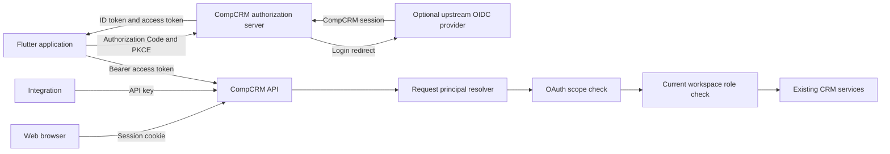
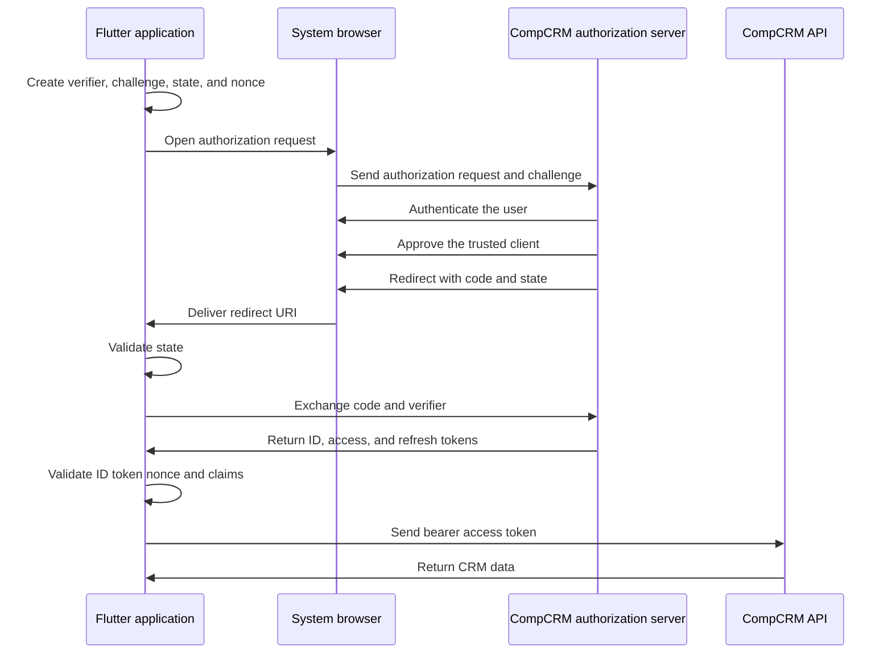

# CRM OAuth 2.1 and OpenID Connect Changes

This document specifies CRM changes for secure Flutter access.

It preserves browser sessions and API keys.

It adds standards-based OAuth 2.1 and OpenID Connect support.

The CRM remains a single-tenant system.

> [!IMPORTANT]
> The CRM implementation in this document is complete.
> The Flutter client work remains a separate application change.

## Implementation status

Implemented on `feat/oauth`:

- Better Auth runtime packages use version 1.7.2.
- Better Auth CLI uses its latest 1.4.22 release.
- OAuth Provider and JWT plugins issue CompCRM tokens.
- Prisma migration `20260829113915_add_oauth_provider` adds OAuth storage.
- Startup reconciles the official `compcrm-flutter` public client.
- One request-principal resolver accepts cookies, API keys, and bearer tokens.
- tRPC queries require `crm.read` for OAuth callers.
- tRPC mutations require `crm.write` for OAuth callers.
- Native protected controllers use the same principal and scope guard.
- OAuth, OpenID Connect, protected-resource, and JWKS metadata are public.
- OpenAPI describes cookie, API-key, and bearer alternatives.
- The web application preserves signed authorization state through sign-in.
- The web application provides a custom-client consent page.

## 1. Executive decision

CompCRM must become an OAuth 2.1 authorization server for first-party mobile clients.

The server must also expose OpenID Connect discovery and identity tokens.

The Flutter application must use Authorization Code Flow with PKCE.

The CRM API must accept short-lived OAuth access tokens.

The browser application must continue to use Better Auth session cookies.

Existing integrations must continue to use API keys.

The three credential types must resolve into one request principal.

Current role checks must remain the final authorization boundary.

OAuth scopes must restrict each client before role checks run.

The implementation must not accept access tokens from upstream identity providers.

The implementation must not add tenant headers or organization parameters.

### 1.1 Recommendation summary

| Decision | Recommendation |
| --- | --- |
| Authorization server | Use the Better Auth OAuth Provider plugin. |
| Identity protocol | Enable OpenID Connect through the `openid` scope. |
| Mobile flow | Use Authorization Code Flow with PKCE and a system browser. |
| Mobile client | Register one public native client for the official Flutter application. |
| Client secret | Do not issue a secret to the Flutter application. |
| Access tokens | Use signed JWT access tokens with a ten-minute lifetime. |
| Refresh tokens | Rotate refresh tokens and expire them after 30 days. |
| Refresh retry | Allow a 30-second reuse interval for lost mobile responses. |
| API authorization | Require OAuth scopes and current CRM roles. |
| Browser access | Keep existing session-cookie behavior. |
| Automation access | Keep existing API-key behavior. |
| Multi-tenancy | Do not add tenant selection or tenant claims. |
| Dynamic registration | Keep dynamic client registration disabled. |
| Token exchange | Do not add token exchange in the first release. |
| Client credentials | Do not add machine OAuth grants in the first release. |
| Proof of possession | Do not add DPoP in the first release. |

## 2. Starting state

CompCRM currently uses Better Auth as an authentication client and session manager.

The API mounts Better Auth routes under `/api/auth/*`.

The web application authenticates with Better Auth cookies.

The API also accepts Better Auth API keys.

The API does not accept OAuth bearer access tokens.

The API does not publish OAuth authorization-server metadata.

The database does not contain OAuth client, consent, token, or signing-key tables.

The OpenAPI documents contain cookie and API-key schemes only.

The tRPC context loads a Better Auth session from request headers.

The current authorization middleware requires a session user.

The current SSO feature connects CompCRM to an external OIDC provider.

That feature makes CompCRM an OIDC client.

It does not make CompCRM an authorization server.

### 2.1 Existing authentication paths

| Caller | Credential | Authentication path | Current result |
| --- | --- | --- | --- |
| Web browser | Session cookie | Better Auth session lookup | Supported |
| Integration | `x-api-key` | Better Auth API-key session | Supported |
| Flutter application | Bearer access token | No verifier exists | Not supported |
| External OIDC provider | Authorization response | Better Auth SSO | Supported for web sign-in |

### 2.2 Existing authorization model

CompCRM uses one fixed workspace.

`WORKSPACE_ID` identifies this workspace.

Sign-in adds the user to this workspace.

Workspace membership uses the existing organization records.

Owner, administrator, and member roles control CRM actions.

Service procedures enforce those permissions.

The OAuth implementation must reuse these checks.

### 2.3 Verified source findings

| Evidence | Finding | Implementation path |
| --- | --- | --- |
| `packages/auth/src/auth.ts` | Better Auth has SSO, organization, API-key, and generic OAuth plugins. | Add OAuth Provider and JWT plugins here. |
| `apps/api/src/trpc/trpc.context.ts` | The context only requests a Better Auth session. | Resolve one typed request principal here. |
| `apps/api/src/trpc/middlewares/auth.middleware.ts` | Protected procedures require `ctx.session.user`. | Require `ctx.principal.user` instead. |
| `apps/api/src/trpc/middlewares/session-only.middleware.ts` | Session-only access checks the API-key header. | Check the resolved credential kind instead. |
| `apps/api/src/create-app.ts` | OpenAPI defines cookie and API-key security. | Add an OAuth bearer scheme. |
| `apps/app/proxy.ts` | The proxy gates routes with a session cookie. | Permit authenticated OAuth consent routes. |
| `packages/db/prisma/schema.prisma` | OAuth Provider tables were absent. | The migration adds the generated models. |
| `packages/auth/package.json` | Runtime packages used version 1.6.25. | Runtime packages now use version 1.7.2. |

## 3. Target architecture

The CRM owns authorization, token issuance, and token verification.

An upstream SSO provider still owns optional workforce authentication.

The Flutter client never handles the upstream provider token directly.

The Flutter client receives only CompCRM tokens.



### 3.1 Trust boundaries

The Flutter application is a public client.

It cannot protect a client secret.

PKCE protects the authorization code.

The system browser protects the user authentication session.

The API validates every bearer token locally or through the provider verifier.

The API never trusts mobile claims without signature validation.

The database protects refresh tokens, client records, consent records, and signing keys.

### 3.2 Protocol endpoints

Better Auth must provide the applicable OAuth and OpenID Connect endpoints.

The final paths depend on the mounted Better Auth base path.

Integration tests must verify the public paths before release.

The public surface must include these capabilities:

| Capability | Standard endpoint purpose |
| --- | --- |
| Authorization | Starts user authorization and returns a code. |
| Token | Exchanges codes and refresh tokens. |
| User information | Returns identity claims for valid access tokens. |
| Revocation | Revokes supported tokens. |
| Introspection | Reports token state for authorized callers. |
| End session | Ends the related login session. |
| Authorization metadata | Publishes OAuth server capabilities. |
| OpenID metadata | Publishes OIDC issuer and endpoint metadata. |
| JWKS | Publishes public signing keys. |

The issuer must use the public `API_URL` origin.

The login and consent pages must use the public `APP_URL` origin.

Discovery documents must report the exact public endpoints.

Proxy or load-balancer rewrites must not change the reported issuer.

## 4. Required CRM changes

### 4.1 Align authentication dependencies

Align `better-auth` and every runtime plugin first.

Use version 1.7.2 for all runtime packages.

Use CLI version 1.4.22.

The CLI uses an independent release sequence.

Commit the package-lock changes with the implementation.

Run existing authentication tests before schema generation.

Run them again after dependency alignment.

Do not combine a version upgrade with unrelated authentication refactoring.

### 4.2 Add the OAuth Provider plugin

Add `@better-auth/oauth-provider` to `packages/auth`.

Add the Better Auth JWT plugin from the aligned release.

Keep existing SSO, organization, API-key, and generic OAuth plugins.

Disable the standalone JWT `/token` endpoint.

Disable JWT headers on normal session responses.

Only the OAuth Provider must issue API access tokens.

Create `packages/auth/src/oauth-config.ts` for tunable OAuth values.

Group every duration and scope in one exported constant.

Do not place token durations beside individual consumers.

The configuration should contain these values:

```ts
const MINUTE_SECONDS = 60;
const DAY_SECONDS = 24 * 60 * MINUTE_SECONDS;

export const OAUTH = {
  accessTokenTtlSeconds: 10 * MINUTE_SECONDS,
  authorizationCodeTtlSeconds: 10 * MINUTE_SECONDS,
  refreshTokenTtlSeconds: 30 * DAY_SECONDS,
  refreshTokenReuseIntervalSeconds: 30,
  scopes: {
    identity: ["openid", "profile", "email", "offline_access"],
    crm: ["crm.read", "crm.write"],
  },
  resource: new URL("/api", apiUrl).toString(),
} as const;
```

Do not duplicate these values in the API or Flutter application.

### 4.3 Register the official Flutter client

Register one public native OAuth client.

Use a stable identifier such as `compcrm-flutter`.

Do not assign a client secret.

Set the token endpoint authentication method to `none`.

Permit only authorization-code and refresh-token grants.

Permit only the code response type.

Require PKCE with `S256`.

Use exact redirect URIs.

Reject wildcard redirect URIs.

Use an application-owned HTTPS link where platform support is complete.

Use a reverse-domain private scheme only as a controlled fallback.

Use loopback redirects only for desktop development.

Enable `skip_consent` only for the bundled first-party client.

Keep consent for every custom client.

Do not enable dynamic client registration.

Create an idempotent client reconciliation command.

The command must create or update only the official client record.

The command must reject unsafe redirect URI changes.

Custom self-hosted clients require an administrator registration command.

Reconcile the bundled client from the repository root:

```bash
bun run --filter=@crm/auth oauth:reconcile-client
```

Register a custom public native client from the repository root:

```bash
bun run --filter=@crm/auth oauth:register-client --client-id example-native --name "Example Native" --redirect-uri com.example.app:/oauth/callback --post-logout-redirect-uri com.example.app:/oauth/logout
```

Repeat `--redirect-uri` or `--post-logout-redirect-uri` for each exact address.

The registration command rejects duplicates, fragments, wildcards, and unsafe transport schemes.

### 4.4 Generate the database schema

Run the Better Auth CLI against the final plugin configuration.

Inspect the generated Prisma changes before creating a migration.

Expected records include OAuth clients, consents, access tokens, and refresh tokens.

Expected records also include client assertions and signing keys.

Exact model names depend on the aligned Better Auth release.

The CLI parser rejects the existing valid Prisma filtered indexes.

Generate the OAuth schema into an isolated Prisma file.

Merge the exact generated models into the repository schema.

Create one reviewed Prisma migration.

Run the migration against a disposable test database first.

The test database name must end with `_test`.

Verify migration rollback behavior through a database snapshot.

Do not delete OAuth tables during an application rollback.

### 4.5 Create a unified request principal

Create a domain type at the authentication boundary.

Do not pass untyped authentication data through the API.

The type should represent these fields:

```ts
type CredentialKind = "session" | "apiKey" | "oauth";

type RequestPrincipal = {
  credentialKind: CredentialKind;
  user: SessionUser;
  clientId: string | null;
  scopes: ReadonlySet<string>;
};
```

Derive the real type from validated provider output where available.

Do not trust arbitrary token claim objects.

Create a request-principal service in `apps/api/src/auth`.

The service must inspect the request once.

It must reject requests containing multiple credential types.

This rule prevents credential confusion attacks.

The resolver must use this order:

1. Detect cookie, API-key, and bearer credentials.
2. Reject an ambiguous request with HTTP 400.
3. Verify OAuth bearer credentials with the provider verifier.
4. Resolve session and API-key credentials through Better Auth.
5. Return one typed principal.
6. Return no principal for an anonymous request.

The bearer verifier must validate these properties:

| Property | Required validation |
| --- | --- |
| Signature | A current trusted JWKS key signs the token. |
| Issuer | The issuer exactly matches the public CompCRM issuer. |
| Audience | The audience includes the CompCRM API resource. |
| Expiry | The current time precedes `exp`. |
| Activation | The current time follows `nbf`, when present. |
| Subject | The subject maps to a current CompCRM user. |
| Client | The client identifier names an enabled OAuth client. |
| Scope | The token contains every required OAuth scope. |

Reject malformed bearer values with HTTP 401.

Reject expired or invalid tokens with HTTP 401.

Reject insufficient scopes with HTTP 403.

Return a standards-compatible `WWW-Authenticate` header.

Never convert a verification failure into an anonymous request silently.

### 4.6 Update tRPC context and middleware

Add `principal` to `BaseTrpcContext`.

Keep `session` temporarily when existing call sites still need it.

Remove the duplicate session field after migration.

Change `AuthMiddleware` to require `ctx.principal.user`.

Build `AuthedTrpcContext` from the typed principal.

Change session-only checks to inspect `credentialKind`.

Do not inspect raw credential headers in downstream middleware.

The API-key management router must accept browser sessions only.

OAuth tokens must not create, list, or revoke API keys.

API keys must not manage other API keys.

### 4.7 Enforce OAuth scopes

Define the first CRM resource scopes as follows:

| Scope | Meaning |
| --- | --- |
| `openid` | Request an OpenID Connect identity token. |
| `profile` | Request standard profile claims. |
| `email` | Request standard email claims. |
| `offline_access` | Request refresh-token access. |
| `crm.read` | Read CRM resources. |
| `crm.write` | Create, update, or delete CRM resources. |

OAuth scopes restrict the client.

Workspace roles restrict the user.

Both checks must pass.

Do not place owner or administrator status in durable access-token claims.

Role changes must take effect without waiting for token expiry.

Existing service authorization must load current membership and role data.

Use `crm.read` for tRPC queries.

Use `crm.write` for tRPC mutations.

Apply equivalent policies to native REST controllers.

Public procedures must remain public.

Session and API-key behavior must remain unchanged during the first release.

Add finer scopes only after a real client needs them.

Avoid entity-specific scopes during the first release.

### 4.8 Update Nest controller authentication

The Better Auth Nest integration currently protects controller routes.

Bearer support must use the same request-principal resolver.

Create one shared guard or decorator for authenticated controllers.

Do not create a second authorization policy for controllers.

Public controllers must use an explicit public marker.

Protected controllers must require the unified principal.

Controller scope failures must match tRPC failures.

### 4.9 Add OAuth security to OpenAPI

Add an HTTP bearer scheme with JWT format.

Keep the cookie scheme.

Keep the API-key scheme.

Describe protected operations with alternative security requirements.

The alternatives must mean cookie OR API key OR bearer token.

They must not mean all three credentials together.

Add the bearer scheme to the REST bridge document.

Keep public operations without security requirements.

Document `crm.read` and `crm.write` for OAuth clients.

Regenerate any committed client artifacts after the document changes.

### 4.10 Add login and consent routing

Reuse the existing `/sign-in` page for user authentication.

Add an OAuth consent page for custom clients.

Place the page under the existing landing route group.

Add the OAuth route prefix to the proxy ungated list.

Anonymous users must still redirect to `/sign-in`.

Authenticated users must bypass onboarding gates during authorization.

The server page must load client, scope, and consent data.

The client component must render finished plain data.

The client component must not import `@crm/auth` or `@crm/db`.

Shared controls must come from `packages/ui`.

The page must show these values:

- Application name.
- Requested CRM permissions.
- Signed-in account.
- Approve action.
- Deny action.

The official client normally skips this page.

The page remains necessary for custom clients.

### 4.11 Verify discovery routing

Better Auth is mounted under `/api/auth/*`.

OAuth discovery uses standard well-known locations.

The Nest adapter and proxy must expose the locations correctly.

Add end-to-end tests for authorization metadata.

Add end-to-end tests for OpenID configuration.

Add an explicit Nest route adapter when automatic routing fails.

Do not ship a discovery document with unreachable endpoints.

### 4.12 Add bounded authentication logs

Log the authentication method and result.

Log a bounded OAuth error code.

Log the client identifier after validation.

Log the request identifier and user identifier.

Never log access tokens.

Never log refresh tokens.

Never log authorization codes.

Never log request headers, bodies, or query strings.

Do not add product telemetry for this change.

Use operational logs and security metrics only.

## 5. Flutter integration contract

The Flutter application must use a system authentication browser.

Embedded web views must not handle user authentication.

Use `flutter_appauth` for discovery, PKCE, authorization, and refresh.

Use `flutter_secure_storage` for refresh-token storage.

Keep access tokens in memory when practical.

Never store a client secret in the application.

### 5.1 Mobile authorization sequence



### 5.2 Authorization request

The client must request these scopes:

```text
openid profile email offline_access crm.read crm.write
```

The client must send these values:

- Exact registered client identifier.
- Exact registered redirect URI.
- Exact `${API_URL}/api` resource in authorization and token requests.
- Response type `code`.
- PKCE challenge method `S256`.
- Cryptographically random state.
- Cryptographically random nonce.

The client must validate returned state before code exchange.

The client must validate the ID token nonce.

The client must validate issuer, audience, signature, and expiry.

### 5.3 Token storage

Store the refresh token in platform secure storage.

Store the current access token in process memory.

Store token expiry beside the access token.

Do not store tokens in shared preferences.

Do not print tokens during development.

Do not send tokens to crash reporting systems.

Delete all tokens after logout or unrecoverable refresh failure.

Use the strictest available platform storage configuration.

### 5.4 Refresh behavior

Refresh shortly before access-token expiry.

Allow only one refresh operation at a time.

Queue concurrent API requests behind that operation.

Replace the stored refresh token after every successful refresh.

Retry one lost refresh response within the reuse interval.

Stop retrying after `invalid_grant`.

Clear local credentials after terminal refresh failure.

Return the user to sign-in.

Do not loop refresh attempts.

### 5.5 API client behavior

Send the access token in the `Authorization` header.

Use the `Bearer` scheme.

Never place tokens in query parameters.

Use the tRPC client for full CRM feature coverage.

Use generated REST clients only for the documented REST bridge.

The OpenAPI schema cannot describe every tRPC procedure.

Regenerate REST models from the public `/openapi.json` document.

Prefer the OpenAPI Generator `dart-dio` target for REST clients.

Keep authentication and retry behavior in one Dio interceptor.

Do not retry mutations after uncertain transport failures automatically.

### 5.6 Logout behavior

Revoke the refresh token when supported.

Call the end-session endpoint when the user requests full logout.

Delete local tokens even when remote revocation fails.

Close the local authenticated application state.

Do not treat local deletion as server revocation.

## 6. Security requirements

### 6.1 Token lifetime and revocation

Use a ten-minute access-token lifetime.

Use a 30-day refresh-token lifetime.

Rotate refresh tokens on every use.

Use a 30-second refresh reuse interval.

Revoke the refresh chain after detected reuse outside that interval.

JWT access tokens remain valid until expiry.

Session revocation must stop future refresh operations.

Client disablement must stop authorization and refresh operations.

Signing-key rotation must preserve active public keys during overlap.

### 6.2 Redirect security

Match redirect URIs exactly.

Require HTTPS for claimed web redirects.

Allow loopback HTTP only for local native clients.

Reject fragments in registered redirect URIs.

Reject wildcard hosts and paths.

Review private scheme ownership for Android and iOS.

Use universal links or app links where practical.

### 6.3 Request security

Reject multiple credential types.

Reject bearer tokens on session-only routes.

Reject missing required resource audiences.

Reject missing required scopes.

Apply rate limits to authorization, token, refresh, and revocation endpoints.

Keep Better Auth database rate limiting enabled.

Use generic public error messages.

Log bounded internal reason codes.

### 6.4 Authorization security

Never authorize from an ID token.

Never authorize from email claims alone.

Map the access-token subject to the current user.

Load current workspace membership before sensitive actions.

Load current role state before sensitive actions.

Keep service-level ownership and permission checks.

Scopes must never grant a role the user lacks.

### 6.5 Key protection

Protect the OAuth signing-key database records.

Restrict production database access.

Protect `BETTER_AUTH_SECRET` through the existing secret process.

Never export private JWKS values to application logs.

Back up signing keys with the database.

Define a documented emergency rotation process.

## 7. Database and deployment plan

### 7.1 Migration order

1. Align Better Auth package versions.
2. Add provider and JWT plugin configuration.
3. Generate the Prisma schema.
4. Review every generated model and index.
5. Create the database migration.
6. Run migration tests against a `_test` database.
7. Deploy database changes before API changes.
8. Deploy authorization endpoints and bearer verification.
9. Reconcile the official Flutter client.
10. Release the Flutter application.

### 7.2 Compatibility deployment

The first API deployment must retain cookies and API keys.

The new bearer path must be additive.

Existing tRPC callers must continue without changes.

Existing integration keys must continue without changes.

Existing browser sessions must survive the deployment.

The Flutter client must launch after discovery tests pass.

### 7.3 Rollback

Disable the official OAuth client first.

Stop new authorization and refresh operations.

Keep the OAuth database tables.

Keep signing keys until every issued token expires.

Roll back the API implementation after token expiry.

Continue browser and API-key access throughout rollback.

Do not drop OAuth tables during an emergency rollback.

## 8. File change map

| Path | Implemented change |
| --- | --- |
| `packages/auth/package.json` | Align Better Auth versions and add OAuth Provider. |
| `packages/auth/src/auth.ts` | Configure OAuth Provider and JWT plugins. |
| `packages/auth/src/oauth-config.ts` | Define resources, scopes, durations, and client policy. |
| `packages/auth/src/env.ts` | No change. Existing public URLs provide every value. |
| `packages/db/prisma/schema.prisma` | Add generated OAuth Provider and JWKS models. |
| `packages/db/prisma/migrations/<timestamp>_add_oauth_provider` | Add the reviewed database migration. |
| `apps/api/src/auth/request-principal.ts` | Define the validated principal type. |
| `apps/api/src/auth/request-principal.service.ts` | Resolve session, API-key, or OAuth credentials. |
| `apps/api/src/trpc/context.types.ts` | Add the principal to API contexts. |
| `apps/api/src/trpc/trpc.context.ts` | Resolve the principal once per request. |
| `apps/api/src/trpc/middlewares/auth.middleware.ts` | Authenticate through the principal. |
| `apps/api/src/trpc/middlewares/session-only.middleware.ts` | Require the session credential kind. |
| `apps/api/src/trpc/middlewares/oauth-scope.middleware.ts` | Enforce OAuth query and mutation scopes. |
| `apps/api/src/trpc/trpc.module.ts` | Register shared authentication and scope middleware. |
| `apps/api/src/create-app.ts` | Add bearer security to both OpenAPI documents. |
| `apps/api/src/app.module.ts` | Register any required auth services and route adapters. |
| `apps/app/proxy.ts` | Permit authenticated OAuth flow pages. |
| `apps/app/app/(landing)/oauth/consent/page.tsx` | Render the server-owned consent page. |
| `packages/ui` | No change. Existing buttons and spinners render consent actions. |
| `apps/api/test/auth.e2e.spec.ts` | Cover discovery, PKCE issuance, refresh, validation, and compatibility. |
| `apps/api/test/oauth-openapi.e2e.spec.ts` | Cover security schemes and OR alternatives. |
| `.env.example` | No change. OAuth requires no new environment value. |
| `apps/api/src/config/env.validation.ts` | No change. OAuth requires no new environment value. |
| `turbo.json` | No change. OAuth requires no new environment value. |
| `docs/api.md` | Document the final authentication architecture. |
| `docs/environment.md` | Document final environment decisions. |
| `docs/exposed-api.md` | Link the implemented bearer flow and scopes. |

No new environment value is required for the recommended first-party client.

Use `API_URL` for issuer and API resource origins.

Use `APP_URL` for login and consent page origins.

Add no per-package `.env` file.

## 9. Verification plan

### 9.1 Unit tests

Test request-principal resolution for each credential type.

Test anonymous requests.

Test duplicate credential rejection.

Test malformed bearer headers.

Test invalid signatures.

Test incorrect issuers.

Test incorrect audiences.

Test expired tokens.

Test future `nbf` values.

Test disabled clients.

Test deleted users.

Test missing read scopes.

Test missing write scopes.

Test standards-compatible authentication errors.

### 9.2 OAuth end-to-end tests

Test authorization-server metadata.

Test OpenID configuration metadata.

Test JWKS publication.

Test authorization with PKCE `S256`.

Test rejection without PKCE.

Test rejection for a wrong verifier.

Test rejection for a wrong redirect URI.

Test authorization-code reuse rejection.

Test ID token issuer, audience, nonce, and expiry.

Test read access with `crm.read`.

Test mutation rejection without `crm.write`.

Test mutation access with `crm.write`.

Test refresh rotation.

Test bounded refresh-response reuse.

Test refresh reuse detection outside the interval.

Test token revocation.

Test end-session behavior.

Test client disablement.

### 9.3 Compatibility tests

Run every existing authentication test.

Confirm browser session authentication.

Confirm API-key authentication.

Confirm session-only API-key management.

Confirm public sign-in options.

Confirm upstream SSO sign-in.

Confirm fixed workspace membership.

Confirm member, administrator, and owner permissions.

Confirm public tRPC procedures remain public.

Confirm native controller protection.

### 9.4 Documentation tests

Validate both OpenAPI documents.

Confirm each security requirement uses OR alternatives.

Generate the Dart REST client.

Compile the generated Dart client.

Compare documented discovery endpoints with live responses.

Confirm every published endpoint is reachable externally.

### 9.5 Required commands

Use repository scripts when available.

Run these checks from the repository root:

```bash
bun run test
bun run lint
bun run build
git diff --check
```

Run the focused API authentication suite before the full suite.

Use the repository database commands from `docs/setup.md`.

Do not run production migrations from a development checkout.

## 10. Acceptance criteria

The change is complete only after every criterion passes.

- The official Flutter client uses Authorization Code Flow with PKCE.
- The Flutter package contains no client secret.
- The authorization server publishes valid OAuth metadata.
- The authorization server publishes valid OIDC metadata.
- The server publishes a valid JWKS document.
- The API accepts valid CompCRM bearer access tokens.
- The API rejects upstream provider tokens.
- The API validates issuer, audience, signature, expiry, and activation.
- OAuth queries require `crm.read`.
- OAuth mutations require `crm.write`.
- Current workspace roles still control every protected action.
- Session-only routes reject OAuth and API-key credentials.
- Requests with multiple credential types fail.
- Browser sessions continue to work.
- Existing API keys continue to work.
- OpenAPI describes cookie, API-key, and bearer alternatives.
- Refresh tokens rotate successfully.
- Logout deletes local tokens and attempts server revocation.
- Logs contain no tokens, codes, headers, bodies, or query strings.
- Existing authentication and SSO tests pass.
- New OAuth end-to-end tests pass.
- The generated Dart REST client compiles.
- `git diff --check` passes.

## 11. Non-goals

This release does not add multi-tenancy.

It does not add organization selection.

It does not add tenant headers.

It does not expose upstream identity-provider tokens.

It does not replace browser session cookies.

It does not replace existing API keys.

It does not add client-credentials grants.

It does not add dynamic client registration.

It does not add token exchange.

It does not add DPoP.

It does not encode current roles in long-lived token claims.

It does not move domain authorization into the authentication package.

## 12. Delivery phases

### 12.1 Phase A: dependency and schema foundation — complete

Align Better Auth packages.

Add the provider configuration.

Generate and migrate the database schema.

Reconcile the official mobile client at startup.

### 12.2 Phase B: API bearer support — complete

Add the request-principal resolver.

Update tRPC and controller authentication.

Add OAuth scope enforcement.

Add OpenAPI bearer alternatives.

Verify existing clients remain compatible.

### 12.3 Phase C: authorization user experience — complete

Verify discovery routing.

Add the custom-client consent page.

Add exact first-party redirect URIs.

Reconcile the official Flutter client.

### 12.4 Phase D: Flutter release — separate application work

Implement system-browser sign-in.

Implement secure token storage.

Implement serialized refresh behavior.

Implement logout and revocation.

Run mobile platform security tests.

### 12.5 Phase E: controlled enablement — pending deployment

Enable the official OAuth client.

Release to internal testers first.

Monitor authorization and refresh failure rates.

Expand the release after stable results.

## 13. Operational metrics

Track authorization requests by bounded outcome.

Track token exchanges by bounded outcome.

Track refresh attempts by bounded outcome.

Track invalid audience and invalid issuer counts.

Track insufficient-scope counts.

Track client disablement events.

Track signing-key rotation events.

Do not attach tokens or authorization codes to metrics.

Alert on repeated refresh reuse detection.

Alert on sudden invalid-signature increases.

Alert on sustained token endpoint failures.

## 14. References

- [CompCRM exposed API](./exposed-api.md)
- [CompCRM API architecture](./api.md)
- [CompCRM environment rules](./environment.md)
- [CompCRM design rules](./design.md)
- [Better Auth OAuth Provider](https://better-auth.com/docs/plugins/oauth-provider)
- [Better Auth OAuth Provider version 1.6](https://better-auth.com/docs/1.6/plugins/oauth-provider)
- [Flutter AppAuth](https://pub.dev/packages/flutter_appauth)
- [Flutter Secure Storage](https://pub.dev/packages/flutter_secure_storage)
- [OpenAPI Generator Dart Dio](https://openapi-generator.tech/docs/generators/dart-dio/)
- [OAuth 2.0 for Native Apps](https://www.rfc-editor.org/rfc/rfc8252)
- [OAuth 2.0 Authorization Server Metadata](https://www.rfc-editor.org/rfc/rfc8414)
- [OAuth 2.0 Security Best Current Practice](https://www.rfc-editor.org/rfc/rfc9700)
- [Proof Key for Code Exchange](https://www.rfc-editor.org/rfc/rfc7636)

## 15. Final recommendation

CompCRM needs server changes before Flutter can use proper OIDC.

The recommended solution uses Better Auth as the CompCRM authorization server.

It issues CompCRM tokens through Authorization Code Flow with PKCE.

It validates those tokens through one typed API principal.

It combines OAuth scopes with current workspace role checks.

It preserves browser cookies and integration API keys.

This design adds mobile authentication without changing CRM tenancy or business authorization.
